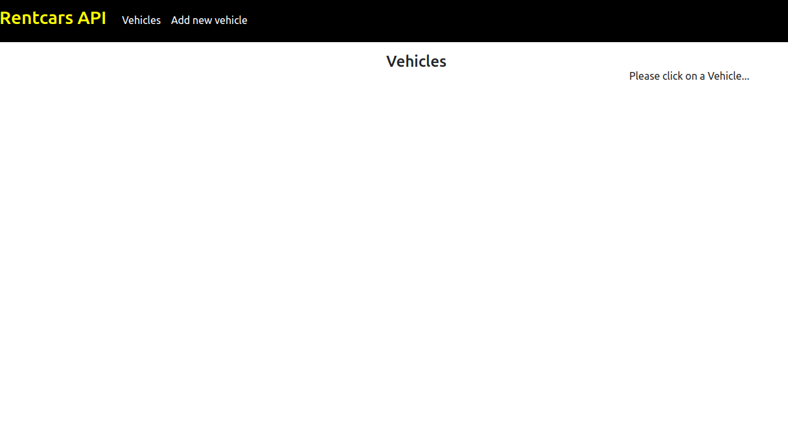
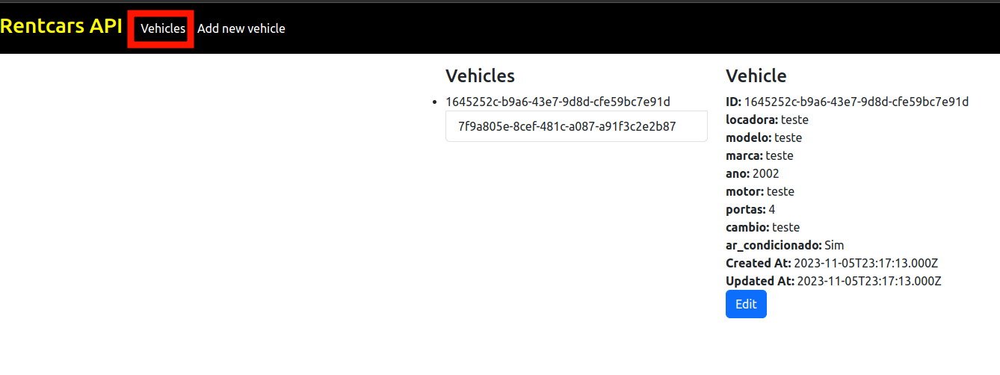
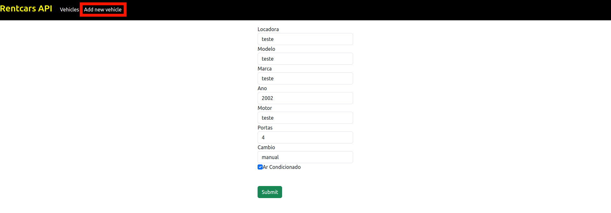
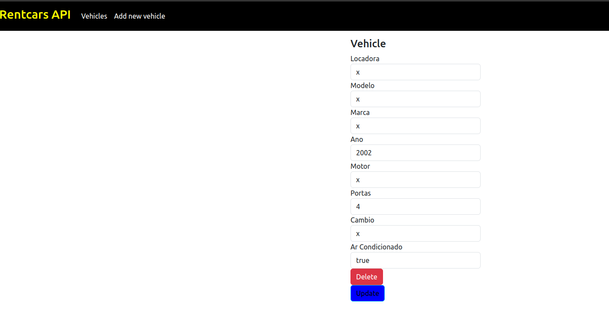
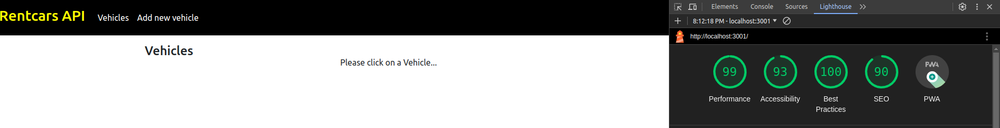
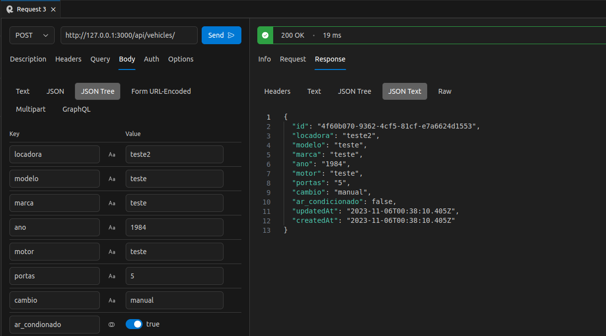

# Desafio-Estagio-Rentcars
Desafio do Programa de Estágio 2023 na Rentcars

## Sobre o Projeto
O projeto é uma aplicação full-stack que visa atender aos requisitos de um aplicativo CRUD (Create, Read, Update, Delete) desenvolvido em Node.js. Este projeto é uma oportunidade de demonstrar minhas habilidades de desenvolvimento e conhecimentos em tecnologias como Node.js, Express, MySQL, Sequelize, a criação de uma API RESTful, assim como meus conhecimentos em um framework de SPA (utilizei REACT)

### Tecnologias Utilizadas
Neste projeto, utilizei as seguintes tecnologias:

- **Node.js:** Plataforma de execução de JavaScript para o lado do servidor.
- **Express:** Framework web para construir APIs de forma simples e eficiente.
- **Mysql2:** Sistema de gerenciamento de banco de dados relacional para armazenar informações dos veículos.
- **Sequelize:** Biblioteca ORM (Object-Relational Mapping) para facilitar a interação com o banco de dados.
- **Cors:** Middleware utilizado para configurar políticas de segurança em APIs, permitindo ou bloqueando solicitações vindas de origens diferentes.
- **Dotenv:** Biblioteca que permite carregar variáveis de ambiente a partir de um arquivo .env
- **Nodemon:** Nodemon é uma ferramenta que monitora as alterações em seu código-fonte e automaticamente reinicia o servidor Node.js
- **Axios:**  Axios é uma biblioteca para fazer requisições HTTP a partir do navegador ou do Node.js, tornando a comunicação com APIs externas mais simples e eficaz.
- **Bootstrap:** Bootstrap é um framework de front-end
- **React:** React é uma biblioteca JavaScript para a criação de interfaces de usuário interativas e componentizadas.
- **React-dom:** React-dom é a parte do React usada para renderizar componentes React no navegador.
- **React-router-dom:**  React-router-dom é uma biblioteca usada para adicionar roteamento à aplicação React, permitindo a criação de páginas e navegação entre elas.
- **Docker:** Docker é uma plataforma que permite criar, implantar e executar aplicativos em contêineres, isolando as dependências do aplicativo e tornando a implantação mais fácil e consistente.

### Funcionalidades
O sistema possui as seguintes funcionalidades:

- **Criação de Veículos:** Permite adicionar novos veículos com informações detalhadas.
- **Leitura de Veículos:** Possibilita a consulta de informações sobre veículos existentes.
- **Atualização de Veículos:** Permite a modificação de informações de veículos já cadastrados.
- **Exclusão de Veículos:** Permite a remoção de veículos do sistema.

## Instruções de Uso

Para testar o sistema, é necessário que o usuário possua as seguintes tecnologias instaladas:
- [Docker](https://www.docker.com/): O Docker é uma plataforma de contêiner que permite empacotar aplicativos e suas dependências em contêineres, tornando o processo de implantação mais fácil e eficiente.
- [Docker Compose](https://docs.docker.com/compose/install/): O Docker Compose é uma ferramenta que permite definir e executar aplicativos multicontêiner em Docker, facilitando a configuração de vários serviços em um único arquivo de configuração.
Após isso basta clonar o projeto no local de preferência e rodar o seguinte comando:
```bash
docker-compose up
```
O docker irá criar criar três imagens:
- **mysqldb:** Este contêiner utiliza a imagem do MySQL 5.7 e cria um ambiente de banco de dados para armazenar os dados dos veículos. As configurações são carregadas a partir de um arquivo `.env` e definem o nome do banco de dados, a senha do root e outras configurações.
- **app:** Este contêiner é responsável por executar o servidor da aplicação Node.js. Ele depende do contêiner `mysqldb` para acessar o banco de dados. As configurações do banco de dados, como host, porta, usuário e senha, são definidas como variáveis de ambiente.
- **front:** Este contêiner executa a parte do cliente do aplicativo, construída em React. Ele depende do contêiner `app` para acessar a API do servidor. O arquivo `Dockerfile` é usado para construir a imagem do contêiner, e a URL da API é passada como uma variável de ambiente.
O sistema pode ser executado pelo comando:
```bash
docker-compose up
```
Caso deseja parar os containers ativos basta rodar:
```bash
docker-compose down
```
O projeto irá rodar nas seguintes portas:
- Front-end: [localhost:3001](http://localhost:3001/)
- API: [localhost:300](http://localhost:3000/)


## Exemplo de Uso

### Home Page

1. Página inicial do aplicativo, clique no botão "Add new vehicle" para adicionar um veículo.



2. Página principal com veículos adicionados.



### Adicionar veiculo

1. Na página para adicionar um veículo é possível preencher o seguinte formulário.



### Editar ou Deletar um Veículo

1. Na lista de veículos ao clicar no botão editar, você encontrará opções para atualizar ou deletar o veículo.




## Teste do projeto

1. Foi utilizado o software lighhouse para testar desempenho do app

2. Para teste da API foi utilizado uma extensão do vs-code chamada [RapidAPI](https://rapidapi.com/)


## Observações
Quando o projeto estava em desenvolvimento, foi possível encontrar algumas vezes um pequeno erro ao inicializar o contâiner com as imagens. Para corrigir bastar reiniciar o processo, rodar novamento o 'docker compose up'
